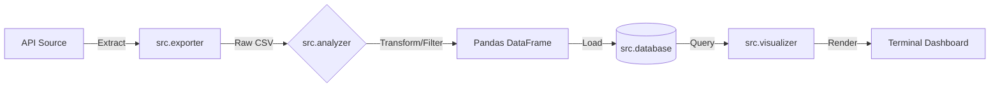

# Python Data Fundamentals: Modular ETL Pipeline

A modular ETL (Extract, Transform, Load) pipeline engineered in Python. Designed for CLI-first environments, it orchestrates data extraction from REST APIs, transformation via Pandas, and storage in a normalized SQLite database, culminating in terminal-based visualization.

## Technologies

* **Language:** Python 3.10+
* **Data Processing:** Pandas
* **Database:** SQLite3
* **Visualization:** Plotext (CLI-based plotting)
* **Environment:** Virtual Environment (.venv)

## Project Architecture

The pipeline follows a strict linear orchestration managed by `main.py`.

