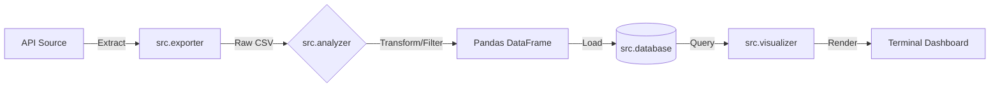

# Python Data Fundamentals: Modular ETL Pipeline

A modular ETL (Extract, Transform, Load) pipeline engineered in Python. Designed for CLI-first environments, it orchestrates data extraction from REST APIs, transformation via Pandas, and storage in a normalized SQLite database, culminating in terminal-based visualization.

## Technologies

* **Language:** Python 3.10+
* **Data Processing:** Pandas
* **Database:** SQLite3
* **Visualization:** Plotext (CLI-based plotting)
* **Environment:** Virtual Environment (.venv)

## Project Architecture

The pipeline follows a strict linear orchestration managed by `main.py`.

## Key Features

* **Modular Extraction:** Fetches user data from external endpoints (JSONPlaceholder) and handles raw data persistence.
* **Data Transformation:** Utilizes Pandas for cleaning and filtering specific business domains.
* **Relational Storage:** Implements a normalized schema in SQLite using Python native cursor execution.
* **CLI Visualization:** Generates analytical dashboards directly in the terminal interface using plotext.

## Installation & Setup

1. Clone the repository:
    git clone https://github.com/aMelo011/python-data-fundamentals.git
    cd python-data-fundamentals

2. Initialize Virtual Environment:
    python3 -m venv .venv
    source .venv/bin/activate

3. Install Dependencies:
    pip install -r requirements.txt

## Usage

Execute the pipeline orchestrator:

    python3 main.py

**Expected Workflow:**
1. Extraction module pulls data from the API.
2. Analyzer module processes and filters the dataset.
3. Database module inserts/updates records in data/users.db.
4. Visualizer module renders a bar chart of user activity in the console.

## Project Structure

    python-data-fundamentals/
    ├── data/               # Local storage for .csv and .db files
    ├── src/
    │   ├── __init__.py
    │   ├── exporter.py     # HTTP Request and CSV writing logic
    │   ├── analyzer.py     # Pandas data cleaning and filtering
    │   ├── database.py     # SQL schema definition and insertion
    │   └── visualizer.py   # Terminal plotting logic
    ├── main.py             # Application Entry Point / Orchestrator
    ├── requirements.txt    # Dependency definitions
    └── README.md           # Documentation

## Roadmap

* Implement logging library for standard output handling.
* Add try/except blocks for robust error handling.
* Containerize the application using Docker.
* Implement CI/CD pipeline via GitHub Actions.

---
**Author:** Alvaro Melo
